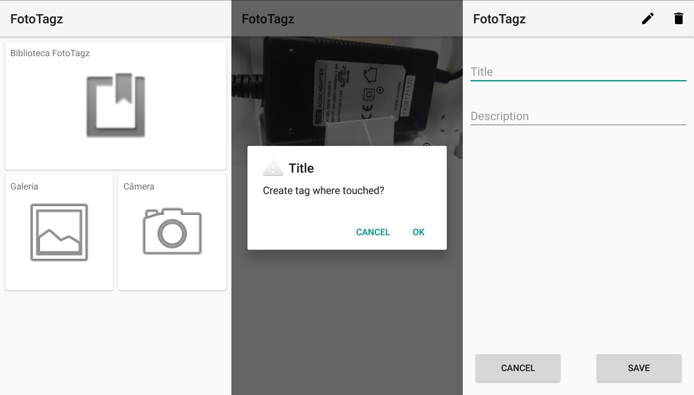

# FotoTagz - Android App

> This is a native android app created for inserting relevant text information directly into your images.

## Features

- Touch parts of images to insert text information
- Images selecting from camera or gallery
- Local tagged library

## Built With

- Realm
- Glide

## 👤 Author 

- Github: [@flpfar](https://github.com/flpfar)
- Twitter: [@flpfar](https://twitter.com/flpfar)
- Linkedin: [Felipe Augusto Rosa](https://www.linkedin.com/in/felipe-augusto-rosa-7b96a4b1)

## Notes

This app was built as a part of the course Systems Development for Mobile Devices, from the Federal Institute of São Paulo (IFSP) - Campus São Carlos.

## 🤝 Contributing

Contributions, issues and feature requests are welcome!

Feel free to check the [issues page](issues/).

## Show your support

Give a ⭐️ if you like this project!
